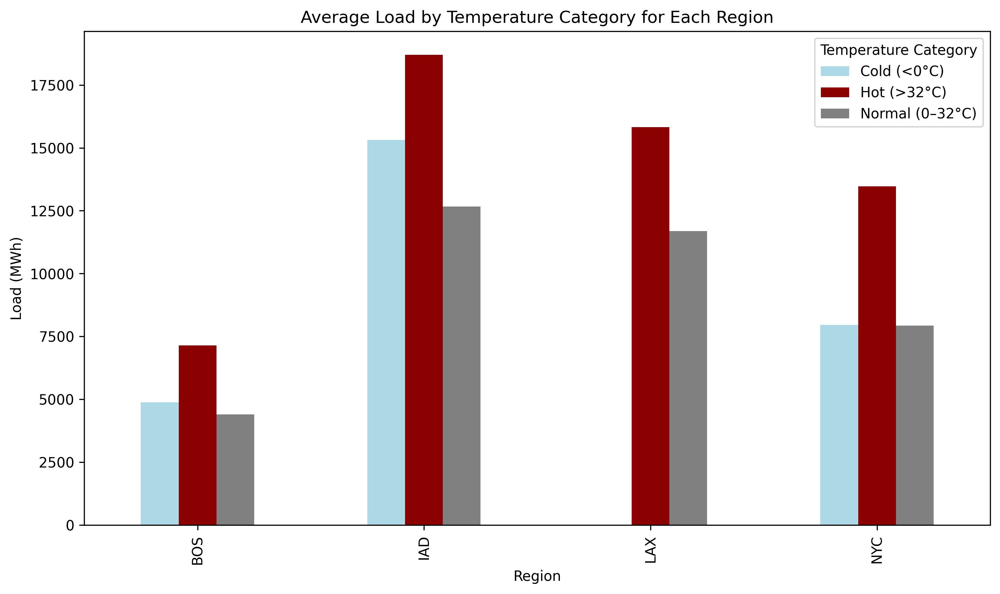
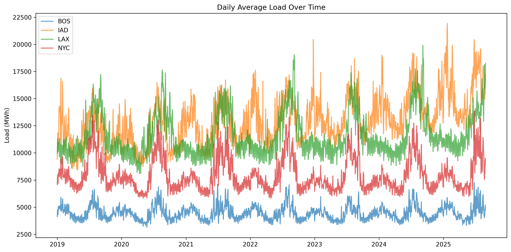
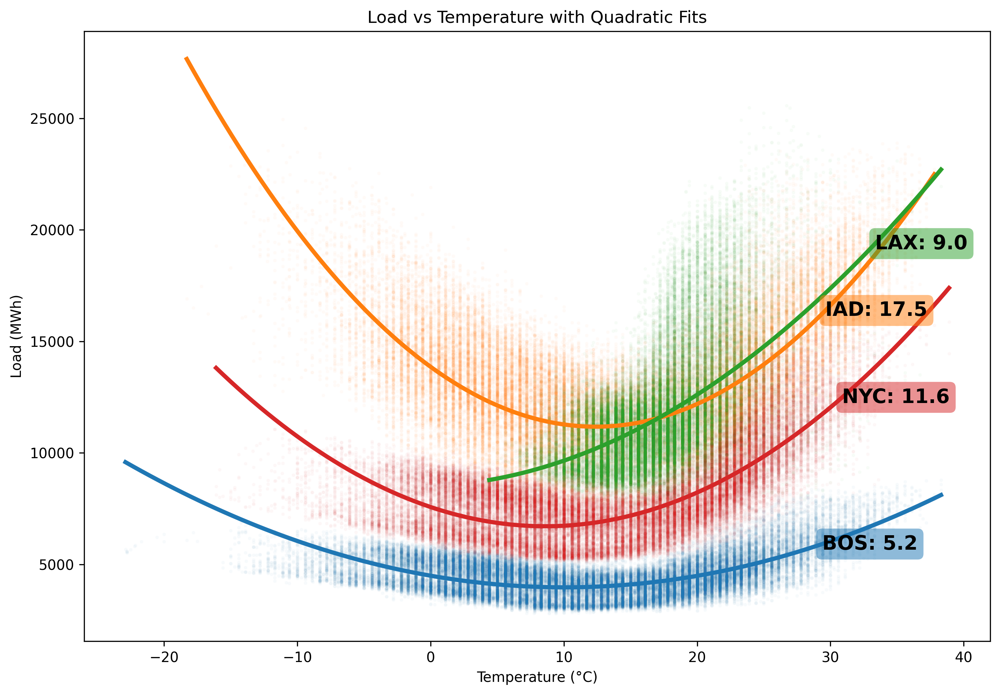
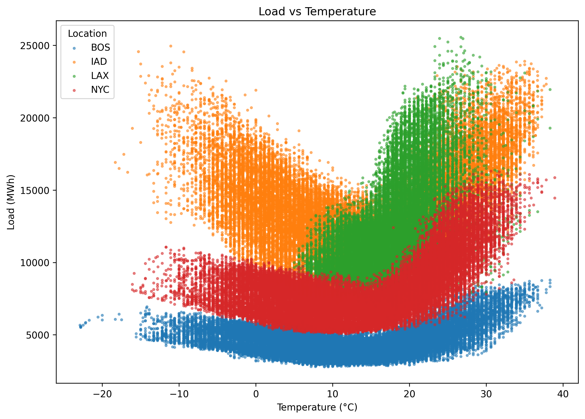

### Names
Karen Guzman and Eva Winston

### Data Source
We are using National Oceanic and Atmospheric Administration (NOAA) and Environmental Impact Assessment (EIA) data to correlate heatwaves and electricity usage across 4 different regions: Washington Dulles (IAD), Boston (BOS), Los Angeles (LAX), and New York City (NYC).

EIA API: https://www.eia.gov/opendata/browser/electricity/rto/region-sub-ba-data
NOAA API: https://www.ncei.noaa.gov/data/global-hourly/access/

### Challenges and Solutions
We encountered several challenges with finding data on our original project idea. Our initial goal was to correlate weather trends with electricity data to analyze the impact of data centers on excessive electricity usage. However, obtaining this precise location information on data centers was far more difficult than expected. Most public sources did not provide the details we needed for our project and as a solution, we decided to toward analyzing broader regional patterns rather than isolating specific data center locations. 

We also found that no single database contained all of the information we needed for our analysis. To fill these gaps, we curated our own dataset by combining weather data with multiple APIs.

We cam across another major obstacle when working with the EIA API. Although we attempted to focus on subregions, the electricity load data provided was inherited from larger parent regions. This created the illusion of detailed information on subregions when, in reality, there was no variation. Filtering to a subregion simply returned the parent region's load. The EIA dashboard did not make this relationship immediately transparent, which led to confusion in our pipeline. We resolved this by widening our scope to parent regions themselves, rather than trying to filter out misleading load data from smaller regions or power providers (e.g. Dominion Energy). 

### Analysis
Across the four regions, temperature and electricity load form a consistent U-shape, but the magnitude of the curvature varies by location. The basic scatter plot shows that load rises both in very cold and very hot conditions, but the quadratic fits quantify the differences. IAD has the steepest curvature, suggesting its demand is highly sensitive to temperature swings in either direction. LAX shows almost no cold-weather response but a strong upward curve in high temperatures, reflecting its climate and reliance on cooling. BOS and NYC fall between these extremes with more moderate curvature.
The bar chart reinforces this. IAD experiences unusually high load on both cold and hot days, while LAX’s load increases almost entirely on hot days. Finally, the daily time-series shows persistent seasonal cycles, with IAD’s winter peaks standing out and LAX showing pronounced summer surges. Overall, the visualizations reveal how the similar temperature changes translate into very different electricity demand profiles depending on regional climate and usage patterns.

### Visualization

### Link
https://github.com/evamaiwinston/heat-grid-analysis
